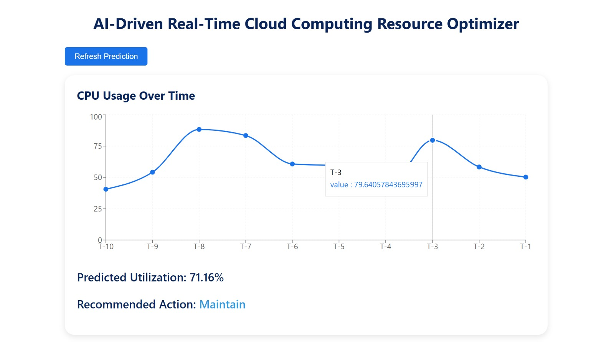

# ☁️ AI-Driven Cloud Resource Optimizer

A sophisticated cloud resource optimization platform that uses advanced LSTM neural networks to predict resource utilization and recommend optimal scaling actions, helping organizations maintain performance while minimizing costs.



## ✨ Features

### 🤖 AI-Powered Predictions
- **LSTM Neural Networks**: Advanced deep learning models for accurate resource utilization forecasting
- **Multi-Metric Analysis**: CPU, Memory, and Network utilization tracking
- **Confidence Scoring**: Prediction confidence indicators for informed decision-making

### 📊 Real-Time Monitoring
- **Live Metrics Stream**: WebSocket-based real-time data updates
- **Interactive Charts**: Beautiful, responsive visualizations with Recharts
- **Historical Tracking**: Comprehensive database storage for trend analysis

### 💰 Cost Optimization
- **Cost Calculator**: Real-time cost per hour, month, and year calculations
- **Savings Analysis**: Potential cost savings with percentage indicators
- **ROI Metrics**: Detailed return on investment calculations

### 🎯 Intelligent Recommendations
- **Action Engine**: Automated scaling recommendations (Scale Up/Down/Maintain)
- **Urgency Indicators**: Priority-based action recommendations
- **Reason Explanations**: Detailed explanations for each recommendation

### 🔧 Production-Ready
- **RESTful API**: Well-structured FastAPI backend with comprehensive endpoints
- **Database Integration**: SQLite database with SQLAlchemy ORM
- **Model Persistence**: Saved and loaded trained models
- **Error Handling**: Robust error handling and validation
- **API Documentation**: Auto-generated OpenAPI/Swagger documentation

## 🏗️ Architecture

### Backend
- **FastAPI**: Modern, fast Python web framework
- **TensorFlow/Keras**: LSTM model implementation
- **SQLAlchemy**: Database ORM
- **WebSockets**: Real-time communication
- **Pydantic**: Data validation

### Frontend
- **React**: Modern UI framework
- **Recharts**: Beautiful chart visualizations
- **Axios**: HTTP client
- **WebSocket API**: Real-time updates

## 🚀 Quick Start

### Prerequisites
- Python 3.8+
- Node.js 14+
- npm or yarn

### Backend Setup

1. Navigate to the backend directory:
```bash
cd cloud-resource-optimizer/backend
```

2. Create a virtual environment (recommended):
```bash
python -m venv venv
source venv/bin/activate  # On Windows: venv\Scripts\activate
```

3. Install dependencies:
```bash
pip install -r requirements.txt
```

4. Start the server:
```bash
uvicorn main:app --reload --port 8000
```

The API will be available at `http://localhost:8000`
API documentation: `http://localhost:8000/docs`

### Frontend Setup

1. Navigate to the frontend directory:
```bash
cd cloud-resource-optimizer/frontend
```

2. Install dependencies:
```bash
npm install
```

3. Start the development server:
```bash
npm start
```

The frontend will be available at `http://localhost:3000`

## 📡 API Endpoints

### Metrics
- `GET /api/metrics/current` - Get current real-time metrics
- `GET /api/metrics/history` - Get historical metrics
- `GET /api/metrics/predictions` - Get prediction history

### Predictions
- `GET /api/predict/` - Get current prediction and recommendation
- `GET /api/predict/action` - Get detailed action recommendation

### Dashboard
- `GET /api/dashboard/stats` - Get comprehensive dashboard statistics

### WebSocket
- `WS /ws` - Real-time metrics stream (updates every 2 seconds)

### Health Check
- `GET /health` - API health status

## 🎨 UI Features

### Dashboard Components
1. **Metric Cards**: Real-time CPU, Memory utilization with trend indicators
2. **Cost Card**: Detailed cost analysis with savings potential
3. **Action Card**: Recommended scaling actions with urgency indicators
4. **Interactive Charts**: Multi-metric time-series visualizations
5. **Real-Time Stream**: Live metrics feed with WebSocket updates

### User Controls
- **Realtime Toggle**: Switch between real-time and manual refresh modes
- **Refresh Button**: Manual data refresh
- **Responsive Design**: Mobile-friendly interface

## 🔧 Configuration

Edit `backend/config.py` to customize:
- Scaling thresholds
- Cost settings
- Model parameters
- CORS origins
- Database URL

## 📊 Model Details

### LSTM Architecture
- **Input Layer**: 10 time steps of historical data
- **LSTM Layers**: 64 and 32 units with dropout
- **Dense Layers**: 16 and 1 unit
- **Activation**: ReLU for hidden layers
- **Optimizer**: Adam
- **Loss Function**: Mean Squared Error

### Training
- Model trains on realistic synthetic data with patterns (trends, seasonality, spikes)
- Automatic model persistence and loading
- Early stopping for optimal training

## 🗄️ Database Schema

### Tables
- **metrics**: Historical resource utilization data
- **predictions**: Prediction history with confidence scores
- **action_history**: Scaling action audit log

## 🐳 Docker Support (Coming Soon)

Docker configuration files will be added for easy deployment.

## 📈 Future Enhancements

- [ ] Multi-cloud provider integration (AWS, Azure, GCP)
- [ ] Actual scaling actions via cloud APIs
- [ ] User authentication and authorization
- [ ] Email/Slack notifications
- [ ] Anomaly detection
- [ ] Advanced analytics dashboard
- [ ] Export functionality (CSV/JSON)
- [ ] Multi-user support with roles

## 🤝 Contributing

Contributions are welcome! Please feel free to submit a Pull Request.

## 📝 License

This project is open source and available under the MIT License.

## 👨‍💻 Development

### Project Structure
```
cloud-resource-optimizer/
├── backend/
│   ├── main.py              # FastAPI application
│   ├── config.py            # Configuration settings
│   ├── database.py          # Database models and setup
│   ├── schemas.py           # Pydantic models
│   ├── model/
│   │   └── lstm_model.py    # LSTM model implementation
│   ├── routers/
│   │   ├── metrics.py       # Metrics endpoints
│   │   ├── predictions.py  # Prediction endpoints
│   │   └── dashboard.py    # Dashboard endpoints
│   ├── services/
│   │   ├── cost_calculator.py  # Cost calculation logic
│   │   └── action_engine.py   # Action recommendation engine
│   └── utils/
│       └── simulate_data.py    # Data simulation
└── frontend/
    ├── src/
    │   ├── App.js
    │   └── components/
    │       ├── Dashboard.js
    │       ├── Chart.js
    │       ├── MetricCard.js
    │       ├── ActionCard.js
    │       └── CostCard.js
    └── package.json
```

## 🐛 Troubleshooting

### Backend Issues
- Ensure all dependencies are installed: `pip install -r requirements.txt`
- Check that port 8000 is available
- Verify database file permissions

### Frontend Issues
- Clear node_modules and reinstall: `rm -rf node_modules && npm install`
- Check that port 3000 is available
- Verify API connection in browser console

### Model Issues
- Delete `backend/models/` directory to retrain model
- Check TensorFlow installation: `python -c "import tensorflow as tf; print(tf.__version__)"`

## 📞 Support

For issues and questions, please open an issue on the repository.

---

**Built with ❤️ using FastAPI, React, and TensorFlow**


