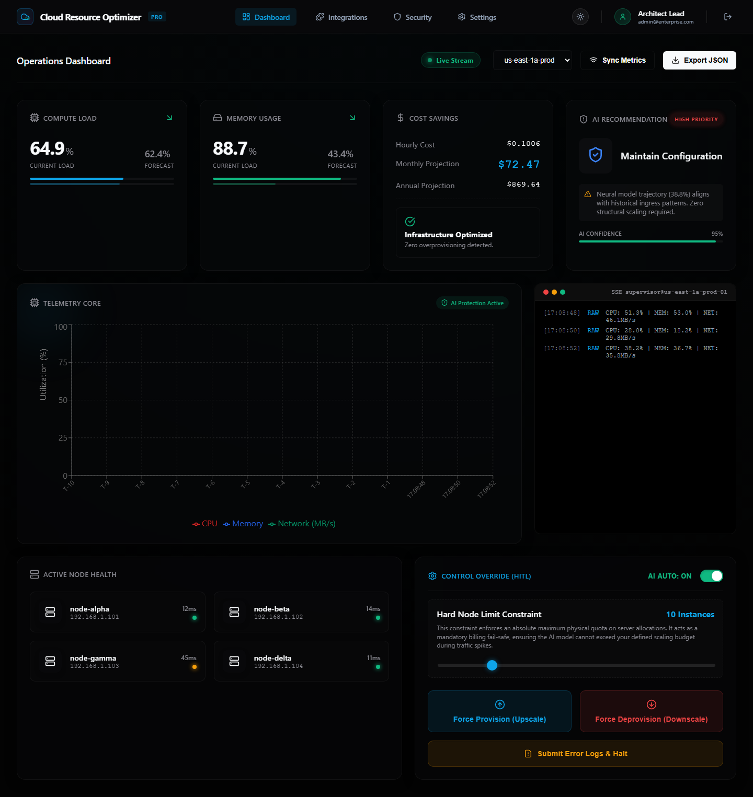
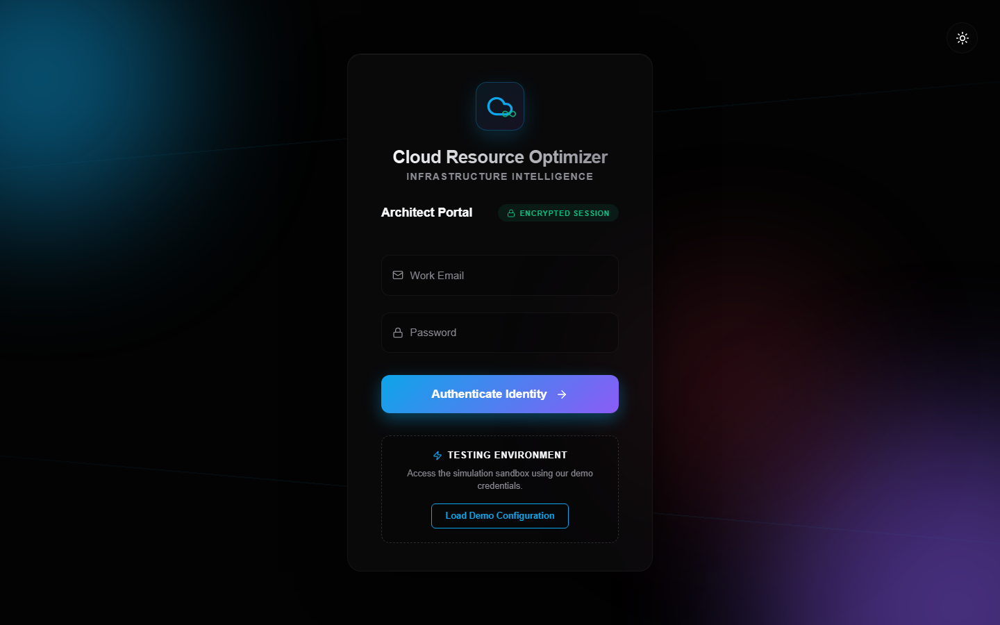
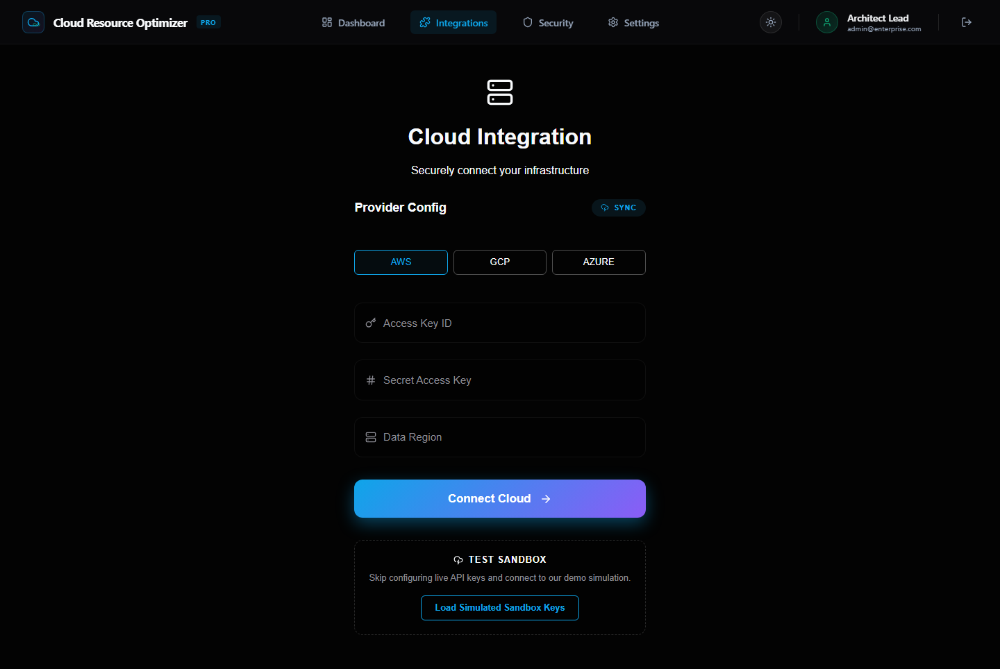
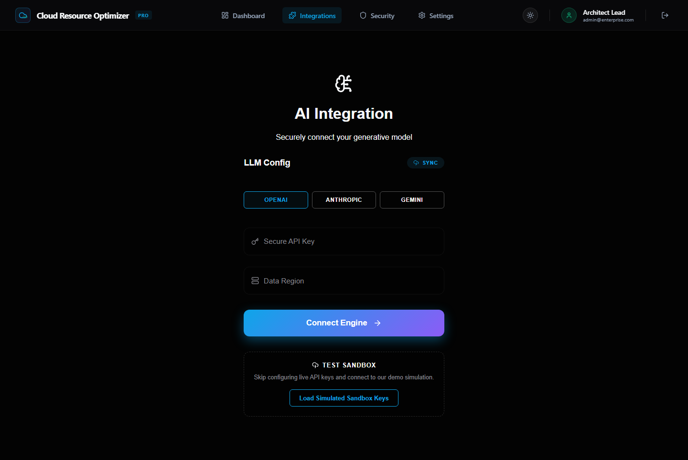
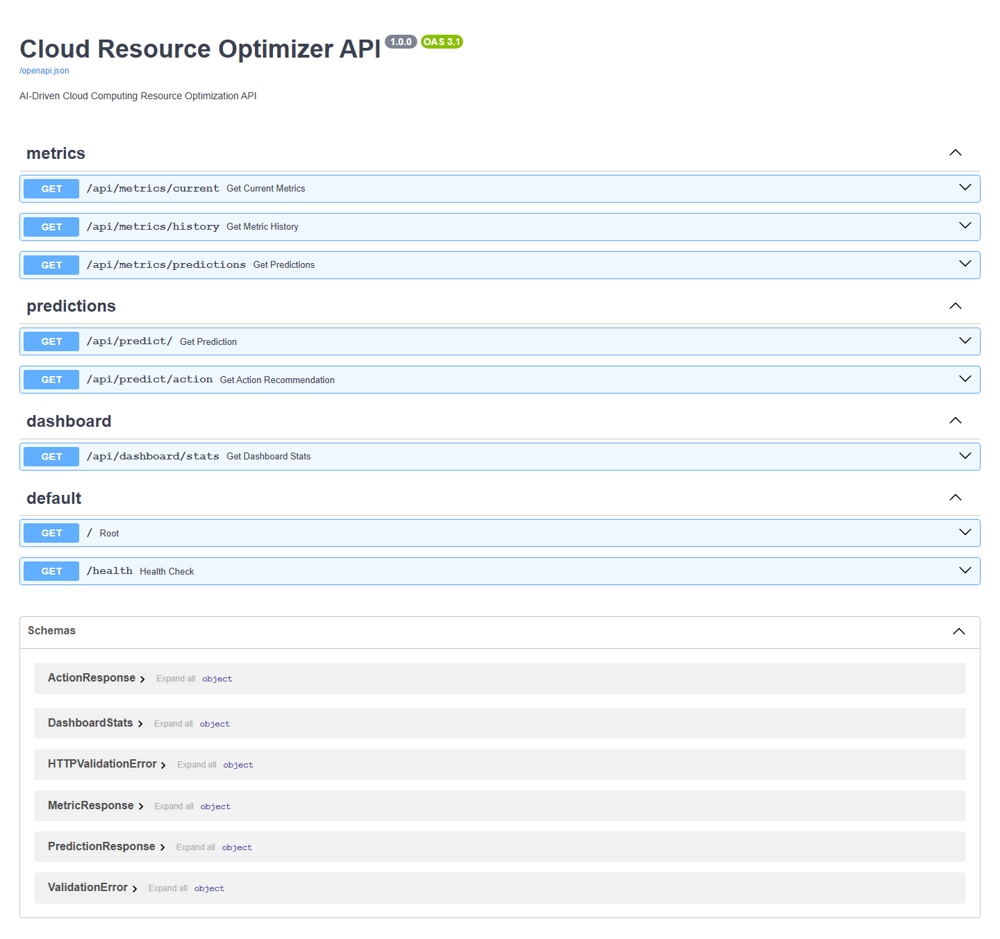
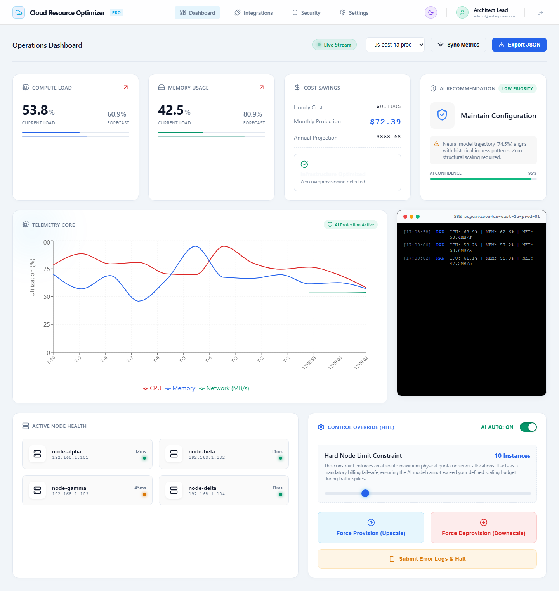
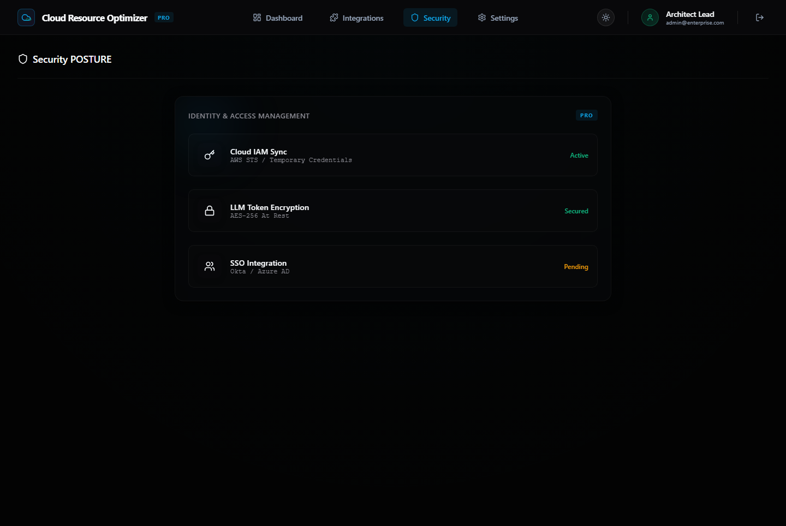
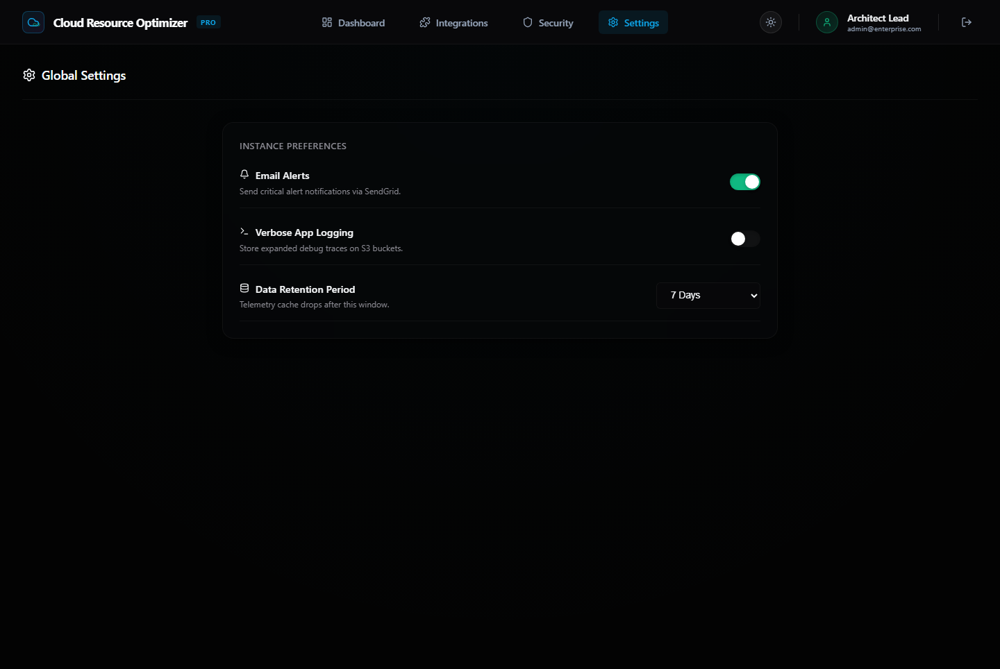
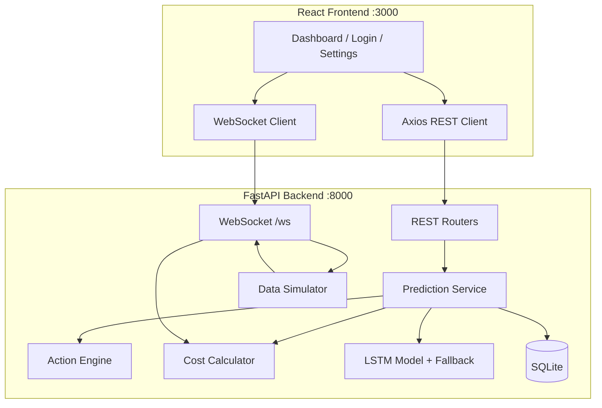

# AI-Driven Real-Time Cloud Resource Optimizer

<p align="center">
  
  
  
  
  
  
</p>

<p align="center">
  <strong>AI-powered cloud cost optimization for enterprises and SMBs.</strong><br/>
  Predict workload demand in real time, automate scaling decisions, and reduce cloud costs by up to 20%.
</p>


<p align="center">
  <a href="#-quick-start">Quick Start</a> •
  <a href="#-screenshots">Screenshots</a> •
  <a href="#-architecture">Architecture</a> •
  <a href="#-api-reference">API</a> •
  <a href="#-for-reviewers">For Reviewers</a>
</p>

---

## Overview

**Cloud Resource Optimizer** is a B2B cloud operations platform built for **enterprises and SMBs** that need to control rising infrastructure costs without compromising uptime. It uses real-time ML forecasting to predict CPU, memory, and network utilization — then recommends or automates the right scaling action before you overpay for idle capacity or under-provision during spikes.

Built for **DevOps, FinOps, and platform engineering teams**, the platform delivers:

- **Predictive scaling** — LSTM models forecast utilization 10 steps ahead with confidence scoring
- **Cost intelligence** — hourly, monthly, and annual spend projections with rightsizing recommendations
- **Real-time observability** — live telemetry streams, interactive charts, and node-level health monitoring
- **Governed automation** — human-in-the-loop controls, hard spend caps, and manual override for critical workloads

This repository ships as a **fully interactive local demo** — no cloud account required. Enterprises can evaluate the product experience, API, and ML pipeline before integrating with AWS, Azure, or GCP.

<p align="center">
  
  <br />
  <em>Operations Dashboard — live metrics, predictions, cost analysis, and HITL controls</em>
</p>

---

## Table of Contents

- [Key Highlights](#-key-highlights)
- [Screenshots](#-screenshots)
- [Demo Walkthrough](#-demo-walkthrough)
- [Tech Stack](#-tech-stack)
- [Architecture](#-architecture)
- [Features](#-features)
- [Quick Start](#-quick-start)
- [Train the LSTM Model](#-train-the-lstm-model-optional)
- [API Reference](#-api-reference)
- [LSTM Model](#-lstm-model)
- [Configuration](#-configuration)
- [Project Structure](#-project-structure)
- [For Reviewers](#-for-reviewers)
- [Troubleshooting](#-troubleshooting)
- [Roadmap](#-roadmap)
- [Author](#-author)

---

## Key Highlights

| Area | Business value |
|------|----------------|
| **Cost Reduction** | Identifies overprovisioned resources and surfaces up to 20% infrastructure savings |
| **AI Forecasting** | Multivariate LSTM predicts CPU, memory, network, and disk demand before spikes hit |
| **Auto-Scaling Engine** | Scale up, scale down, or maintain — with urgency scoring and confidence levels |
| **Real-Time Ops** | WebSocket telemetry every 2s keeps teams ahead of utilization changes |
| **FinOps Dashboard** | Hourly → monthly → annual cost projections in one operations view |
| **Enterprise Controls** | HITL overrides, hard node limits, and audit-ready export for compliance teams |

---

## Screenshots

### Authentication & Onboarding

<table>
  <tr>
    <td width="50%">
      
      <p align="center"><strong>Login Portal</strong><br/>Demo credentials with one-click fill</p>
    </td>
    <td width="50%">
      
      <p align="center"><strong>Cloud Integration</strong><br/>AWS / GCP / Azure connection flow</p>
    </td>
  </tr>
  <tr>
    <td width="50%">
      
      <p align="center"><strong>LLM Configuration</strong><br/>OpenAI, Anthropic, or Gemini setup</p>
    </td>
    <td width="50%">
      
      <p align="center"><strong>FastAPI Docs</strong><br/>Interactive Swagger UI at /docs</p>
    </td>
  </tr>
</table>

### Operations Dashboard

<table>
  <tr>
    <td width="50%">
      
      <p align="center"><strong>Dashboard (Light Theme)</strong><br/>Metrics, charts, terminal, node health</p>
    </td>
    <td width="50%">
      
      <p align="center"><strong>Dashboard (Dark Theme)</strong><br/>Full dark mode across all components</p>
    </td>
  </tr>
</table>

### Security & Settings

<table>
  <tr>
    <td width="50%">
      
      <p align="center"><strong>Security Posture</strong><br/>IAM sync, encryption, SSO status</p>
    </td>
    <td width="50%">
      
      <p align="center"><strong>Global Settings</strong><br/>Alerts, logging, data retention</p>
    </td>
  </tr>
</table>

> To regenerate screenshots after UI changes: `node scripts/capture-screenshots.mjs` (requires the app running on port 3001).

---

## Demo Walkthrough

1. **Start the app** — run `start-backend.bat` and `start-frontend.bat` (or see [Quick Start](#-quick-start))
2. **Login** — use `admin@enterprise.com` / `admin123`, or click **Load Demo Configuration**
3. **Cloud Setup** — click **Load Demo Configuration**, then connect (simulated validation)
4. **LLM Setup** — same demo fill flow, then proceed to the dashboard
5. **Dashboard** — watch live metrics stream, review AI recommendations, toggle dark mode
6. **Explore** — visit Security and Settings from the navbar; try HITL manual overrides

---

## Tech Stack

| Layer | Technologies |
|-------|-------------|
| **Backend** | Python 3.11, FastAPI, Uvicorn, SQLAlchemy, Pydantic |
| **ML** | TensorFlow/Keras LSTM, NumPy, Pandas |
| **Database** | SQLite (PostgreSQL-ready schema) |
| **Real-Time** | WebSockets (2s interval push) |
| **Frontend** | React 18, React Router v7, Axios, Recharts |
| **UI** | Lucide icons, CSS custom properties, ThemeContext |
| **DevOps** | Docker, docker-compose, Windows/Linux startup scripts |

---

## Architecture


```mermaid
flowchart TB
    subgraph Frontend["React Frontend :3000"]
        UI[Dashboard / Login / Settings]
        WS_Client[WebSocket Client]
        REST[Axios REST Client]
    end

    subgraph Backend["FastAPI Backend :8000"]
        API[REST Routers]
        WSS[WebSocket /ws]
        PS[Prediction Service]
        AE[Action Engine]
        CC[Cost Calculator]
        LSTM[LSTM Model + Fallback]
        SIM[Data Simulator]
        DB[(SQLite)]
    end

    UI --> REST
    UI --> WS_Client
    REST --> API
    WS_Client --> WSS
    API --> PS
    PS --> LSTM
    PS --> AE
    PS --> CC
    PS --> DB
    WSS --> SIM
    WSS --> CC
    SIM --> WSS
```

### Data Flow

1. **Simulator** generates realistic CPU, memory, and network telemetry
2. **Metrics API** stores readings in SQLite and serves history
3. **Prediction Service** builds 10-step sequences and runs LSTM inference (or fallback)
4. **Action Engine** compares predicted utilization against thresholds → scale up / down / maintain
5. **Cost Calculator** projects hourly, monthly, and savings impact
6. **WebSocket** pushes live metrics to the dashboard terminal and charts every 2 seconds

---

## Features

### AI-Powered Predictions
- LSTM neural networks trained on industry-grade cluster telemetry (500K+ rows supported)
- Multivariate input: CPU, memory, network I/O, disk I/O
- Confidence scoring based on input variance
- Automatic fallback to moving-average predictor when no model is trained

### Real-Time Monitoring
- WebSocket live stream (2-second intervals)
- Recharts time-series with historical + real-time overlay
- SSH-style terminal log with color-coded CPU/memory alerts
- Per-node health grid with latency and status indicators

### Cost Optimization
- Real-time hourly cost calculation
- Monthly and annual projections
- Rightsizing recommendations with savings percentage

### Human-in-the-Loop (HITL)
- AI auto-scaling toggle
- Hard node limit slider (billing fail-safe)
- Manual provision / deprovision overrides
- Anomaly report and halt control

### Multi-Page Application
| Page | Route | Purpose |
|------|-------|---------|
| Login | `/login` | Authentication portal |
| Cloud Setup | `/cloud-setup` | Provider connection wizard |
| LLM Setup | `/llm-setup` | AI provider configuration |
| Dashboard | `/dashboard` | Main operations center |
| Security | `/security` | IAM and encryption posture |
| Settings | `/settings` | Alerts and retention prefs |

### Dark / Light Theme
- Unified `ThemeContext` — one toggle, consistent everywhere
- Persisted in `localStorage` across sessions

---

## Quick Start

### Prerequisites
- **Python 3.11+**
- **Node.js 18+**
- npm

### Option A — Startup Scripts (Recommended)

**Windows:**
```bash
start-backend.bat    # Terminal 1 → http://localhost:8000
start-frontend.bat   # Terminal 2 → http://localhost:3000
```

**Linux / Mac:**
```bash
./start-backend.sh
./start-frontend.sh
```

### Option B — Manual Setup

**Backend:**
```bash
cd backend
python -m venv venv
source venv/bin/activate        # Linux/Mac
venv\Scripts\activate           # Windows
pip install -r requirements.txt
python -m uvicorn main:app --reload --port 8000
```

**Frontend:**
```bash
cd frontend
npm install
npm start
```

### Demo Credentials

| Field | Value |
|-------|-------|
| Email | `admin@enterprise.com` |
| Password | `admin123` |

### Docker (Optional)

```bash
docker-compose up
```

---

## Train the LSTM Model (Optional)

The server starts instantly with a **fallback predictor**. To train the full LSTM:

1. *(Optional)* Place `machine_usage.csv` in `backend/data/` — see [backend/data/README.md](backend/data/README.md)
2. Run training:

```bash
cd backend
venv\Scripts\activate          # Windows
python train_model.py
```

Training uses up to 500K rows across 200 machines, 50 epochs with early stopping, and saves to `backend/models/lstm_model.h5`. Without the dataset, synthetic data is used automatically.

---

## API Reference

| Method | Endpoint | Description |
|--------|----------|-------------|
| `GET` | `/` | API info and available routes |
| `GET` | `/health` | Health check |
| `GET` | `/api/metrics/current` | Current real-time metrics |
| `GET` | `/api/metrics/history` | Historical metrics (`?limit=100`) |
| `GET` | `/api/metrics/predictions` | Prediction history |
| `GET` | `/api/predict/` | Current prediction + recommendation |
| `GET` | `/api/predict/action` | Detailed action (`?current_instances=3`) |
| `GET` | `/api/dashboard/stats` | Aggregated dashboard statistics |
| `WS` | `/ws` | Real-time metrics stream (every 2s) |

Interactive docs: **http://localhost:8000/docs**

---

## LSTM Model

### Architecture

| Component | Detail |
|-----------|--------|
| Input | 10 timesteps × 4 features (CPU, Memory, Network, Disk I/O) |
| Layer 1 | LSTM 64 units, ReLU, return sequences + 20% Dropout |
| Layer 2 | LSTM 32 units, ReLU + 20% Dropout |
| Layer 3 | Dense 16 units, ReLU |
| Output | Dense 1 unit (predicted CPU utilization) |
| Optimizer | Adam · Loss: MSE · Metric: MAE |

### Training
- **Data**: Alibaba Cluster Trace 2018 (`machine_usage.csv`) or synthetic fallback
- **Split**: 80% train / 20% validation
- **Early stopping**: patience = 10 on validation loss

### Fallback Mode
When TensorFlow is unavailable or no `.h5` model exists, predictions use moving-average with trend extrapolation — the API still works immediately.

---

## Configuration

Edit `backend/config.py` or set environment variables:

| Setting | Default | Description |
|---------|---------|-------------|
| `scale_up_threshold` | `80.0` | Utilization % to trigger scale-up |
| `scale_down_threshold` | `30.0` | Utilization % to trigger scale-down |
| `instance_cost_per_hour` | `0.10` | Base $/hour per instance |
| `cost_per_cpu_percent` | `0.001` | $/hour per CPU utilization point |
| `sequence_length` | `10` | LSTM input timesteps |
| `cors_origins` | `localhost:3000,3001` | Allowed CORS origins |

---

## Project Structure

```
cloud-resource-optimizer/
├── backend/
│   ├── main.py                     # FastAPI app + WebSocket
│   ├── config.py                   # Settings (env-configurable)
│   ├── database.py                 # SQLAlchemy models
│   ├── schemas.py                  # Pydantic schemas
│   ├── train_model.py              # LSTM training script
│   ├── model/lstm_model.py         # LSTM + fallback predictor
│   ├── routers/                    # metrics, predictions, dashboard
│   ├── services/
│   │   ├── prediction_service.py   # Shared prediction logic
│   │   ├── action_engine.py        # Scaling recommendations
│   │   └── cost_calculator.py      # Cost projections
│   └── utils/simulate_data.py      # Synthetic telemetry
├── frontend/
│   └── src/components/             # Login, Dashboard, Security, etc.
├── docs/screenshots/               # README screenshots
├── scripts/capture-screenshots.mjs # Regenerate screenshots
├── start-backend.bat / .sh
├── start-frontend.bat / .sh
├── docker-compose.yml
└── README.md
```

---

## For Reviewers

This repository is a **local product demo** of the Cloud Resource Optimizer platform. The core engine (API, ML pipeline, real-time streaming, cost modeling) is fully functional; cloud provider connections and auth flows are simulated for safe evaluation.

| Component | Status |
|-----------|--------|
| FastAPI REST + WebSocket API | Production-ready architecture |
| LSTM training & inference | Functional (fallback if no model) |
| SQLite persistence | Functional |
| React operations dashboard | Fully functional |
| Cloud / LLM integrations | Simulated (no credentials transmitted) |
| HITL manual actions | UI workflow demo |
| Node health grid | Sample enterprise fleet data |

**Suggested evaluation path (≈5 min):**
1. Clone → `start-backend.bat` + `start-frontend.bat`
2. Login with demo credentials
3. Click through Cloud Setup → LLM Setup → Dashboard
4. Open `http://localhost:8000/docs` to inspect the API
5. *(Optional)* Run `python train_model.py` in `backend/`

---

## Troubleshooting

| Issue | Fix |
|-------|-----|
| TensorFlow import error (Windows) | See [TENSORFLOW_FIX.md](TENSORFLOW_FIX.md) or recreate venv: delete `backend/venv`, rerun `start-backend.bat` |
| Port 3000 in use | Frontend auto-tries 3001, or set `$env:PORT=3001` before `npm start` |
| Port 8000 in use | `python -m uvicorn main:app --port 8001` |
| Model not loading | Delete `backend/models/lstm_model.h5` and restart, or run `python train_model.py` |
| Blank dashboard data | Ensure backend is running before opening the frontend |

---

## Roadmap

- [ ] Real cloud provider integrations (AWS CloudWatch, Azure Monitor, GCP)
- [ ] JWT authentication with backend validation
- [ ] LLM-powered natural language recommendations
- [ ] PostgreSQL for production database
- [ ] Anomaly detection with Slack / PagerDuty alerts
- [ ] Terraform / IaC auto-remediation
- [ ] Role-based access control (RBAC)

---

## Author

**Aayush Sharma**

*B.Tech Computer Science & Engineering (AI & ML)* — Manipal University Jaipur

---

## License

MIT License — see [LICENSE](LICENSE) for details.
